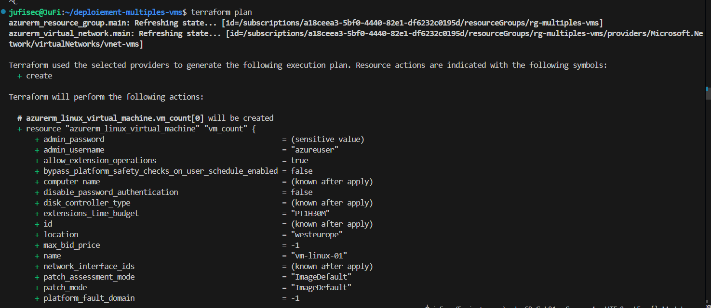
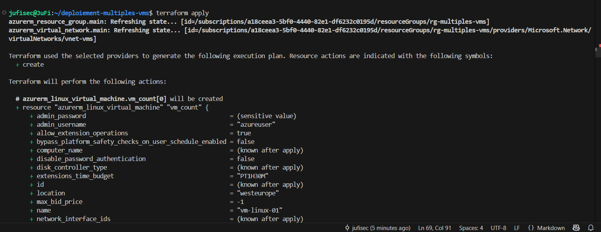
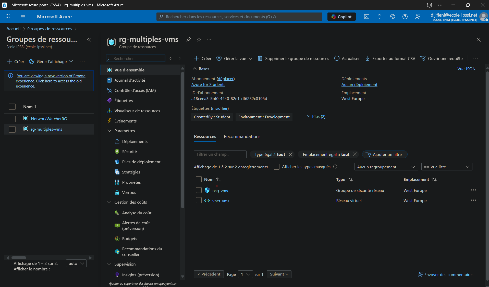

# Déploiement d'une infrastructure de VMs sur Azure avec Terraform

Ce projet déploie une infrastructure complète sur Microsoft Azure en utilisant Terraform. Il a pour but de démontrer les compétences en Infrastructure as Code (IaC) pour automatiser la création de ressources cloud.

## 🏗️ Architecture

L'infrastructure créée par ce code est composée des éléments suivants :
- **Groupe de Ressources** : Un conteneur logique pour toutes les ressources.
- **Réseau Virtuel (VNet)** : Un réseau isolé pour l'infrastructure.
- **Sous-réseau (Subnet)** : Une subdivision du VNet pour y placer les machines virtuelles.
- **Groupe de Sécurité Réseau (NSG)** : Des règles de pare-feu pour autoriser le trafic SSH (port 22).
- **Machines Virtuelles (VMs)** : Plusieurs machines virtuelles Linux (Ubuntu) créées dynamiquement.

## 📸 Captures d'écran

Cette section montre les étapes clés du déploiement, de la planification à la vérification des ressources sur Azure.

### 1. Planification (`terraform plan`)
*La commande `plan` nous montre les ressources qui seront créées avant toute action.*


### 2. Déploiement réussi (`terraform apply`)
*La sortie "Apply complete!" confirme que toutes les ressources ont été créées avec succès.*


### 3. Vérification sur le portail Azure
*Les ressources sont bien visibles dans le groupe de ressources sur le portail Azure.*



## ⚙️ Prérequis

Avant de commencer, assurez-vous d'avoir installé les outils suivants :
- [Terraform](https://www.terraform.io/downloads.html)
- [Azure CLI](https://docs.microsoft.com/en-us/cli/azure/install-azure-cli)
- [Git](https://git-scm.com/downloads)

Vous devez également être connecté à votre compte Azure via l'Azure CLI :
```bash
az login
az account set --subscription "VOTRE_ID_DE_SOUSCRIPTION"
```

## 🚀 Déploiement

1.  **Clonez ce dépôt :**
    ```bash
    git clone [https://github.com/VOTRE_PSEUDO/NOM_DU_PROJET.git](https://github.com/VOTRE_PSEUDO/NOM_DU_PROJET.git)
    cd NOM_DU_PROJET
    ```

2.  **Configurez vos variables locales :**
    Ce projet utilise un fichier `terraform.tfvars.example` comme modèle. Copiez-le pour créer votre propre fichier de configuration `terraform.tfvars`.
    ```bash
    cp terraform.tfvars.example terraform.tfvars
    ```
    Ouvrez le fichier `terraform.tfvars` que vous venez de créer et **remplissez les valeurs**, notamment en définissant un mot de passe sécurisé. Ce fichier est ignoré par Git et ne sera jamais publié.

3.  **Initialisez Terraform :**
    Cette commande télécharge les fournisseurs nécessaires pour communiquer avec Azure.
    ```bash
    terraform init
    ```

4.  **Planifiez le déploiement :**
    Cette commande vous montre un aperçu des ressources que Terraform va créer.
    ```bash
    terraform plan
    ```

5.  **Appliquez la configuration :**
    Lancez la création de l'infrastructure sur Azure. Tapez `yes` lorsque demandé.
    ```bash
    terraform apply
    ```

## 📸 Captures d'écran

Voici une capture d'écran montrant la sortie de la commande `terraform apply` une fois le déploiement terminé avec succès.


## 📄 Licence

Ce projet est sous licence MIT. Voir le fichier [LICENSE](./LICENSE) pour plus de détails.
